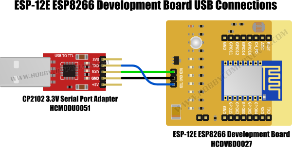
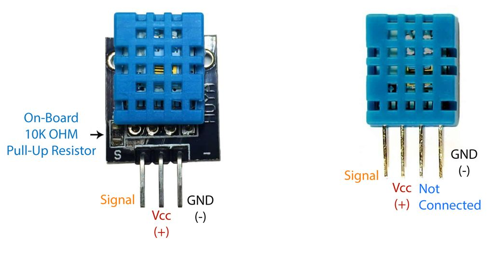
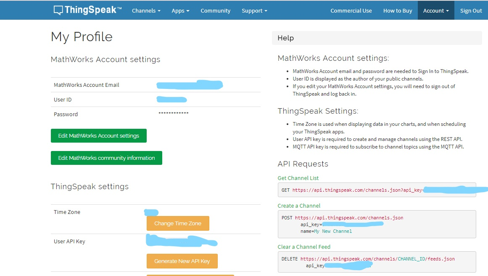
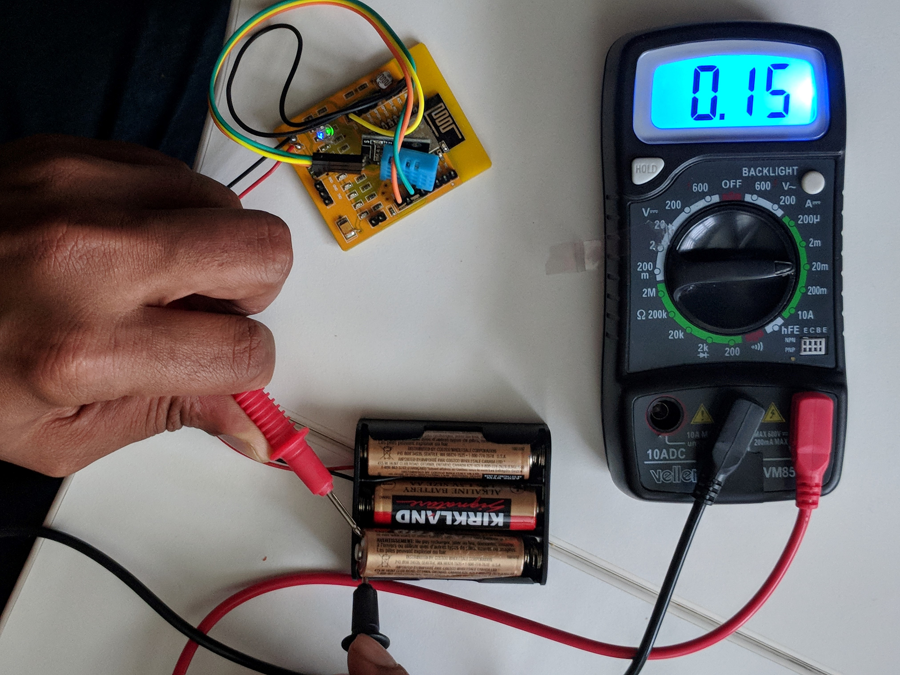

# Make IOT Weather Station using the ESP8266

A weather station is a fun project that teaches you a ton about electronics with the added benefit being an actually useful little device. The project requires a bunch of cheap parts and sensors totaling less than $15, and the whole thing ends up fitting in your hand. The station creates a web site that monitors temperature, dew point, humidity, pressure, light index, and rain (Thingspeak channel). It’s  pretty easy set up, and you’ll just need some basic electronics skills to get it going.
//
A weather station is a good start for Internet of Things project as it is fairly simple and teaches you about electronics, IOT and API's. The project requires mainly a temeperature and moisture sensor and some electronic items as discussed below. The data is uploaded to a website where 2 graphs are plotted over time displaying the change in temp and humidity(ThingSpeak Channel). 
//
## 1. Hardware Required :-
- ESP8266 board  
- USB to Serial Converter 
- Jumper Wires 
- DH11 (Temperature and Humidity Sensor)

ESP8266 Board
There are a bunch of such boards available on the market namely ESP-01 , NodeMCU etc. I bought the following board from ebay because it has an attatched battery case with it . 
This has 2 advantages
- It does not need a plug to work ie can work independently 
- It does'nt need a breadboard or PCB so doesn't require any additional hardware other than the one bought. 

Disadvantage 
- The board does not come with an attatched USB to serial coverter but the 3 pins as shown can be connected to an external one for connecting it to the PC 

USB to serial Converter : 
Buy from : 
This component is reusable i.e. it is only required for uploading the code to the board after that it can be disconnceted

Temperature and Moisture sensor 

The DHT11 is a basic, ultra low-cost digital temperature and humidity sensor. It sends  a digital signal on the digital data pin (no analog input pins needed). The only limitation of the sensor is that it takes 2 seconds for 1 reading . But for this project we don't need data to be transmitted so frequently , mabye a reading in 30 mins is sufficent.

2. Software : Arduino IDE
Arduino IDE is a powerful interface to write the code added advantage is that we can compile , upload the code as well as moniter the values obtained using the serial moniter directly from the application.
The library for ESP8266 needs to be installed

Getting Started 
1. Getting software ready 
The Arduino IDE initially only has the Arduino compiler , so library for ESP8266 needs to be installed first. 

The Arduino Integrated Development Environment (IDE) is the tool you will use to program the
ESP8266. IDEs are more than just editors; they help you with various tasks during the development
process.

To install the Arduino IDE go to https://www.arduino.cc/en/Main/Software and download the latest
version matching your operating system.
Now you have a bare Arduino IDE which brings everything needed to write programs.

For compiling program for the ESP8266 board we need an additional compiler.
The Arduino IDE has a wonderful feature: the Board Manager.
It lets you install support for many different chips and boards . But first of all
we have to tell the Arduino IDE where it should look for board definitions:
Tool Setup 8
Open the Arduino IDE
• Go to file/preferences/settings and in the text box Additional Board Manager URLs enter
this URL: http://arduino.esp8266.com/stable/package_esp8266com_index.json
• Now go to Tools > Board: … > Boards Manager…, search for the ESP8266 board and click
Install.

Selecting the Correct Board
Now your Arduino IDE knows about ESP8266 boards in general. But not all the ESP8266 boards
are the same; there are subtle but important differences in available Flash Memory and how they
can be programmed. The selection of the correct board also defines the names of the GPIO pins:
So let’s pick the correct board. If you bought the board I am using  
Go to Tools > Board: * > Generic ESP8266 Board
The names of GPIO pins is 1 for GPIO 1 and so on

Setting the Correct Port
Go to Tools > Port and select the given port named COMx (x is a no. )

to detect the external Serial-To-USB adapter There are two different versions: some
have the CP2102 Serial-To-USB adapter; others have the CH340. 

If your module has the CP2102 converter then you can download 
https://www.silabs.com/products/mcu/Pages/USBtoUARTBridgeVCPDrivers.aspx

In case your module comes with a CH340 serial-to-USB converter then download 
• Win: http://blog.squix.org/downloads/CH341SER.zip
• Mac: https://blog.squix.org/wp-content/uploads/2016/12/CH34x_Install_V1.3.zip
 
2. Conncet the ESP8266 board with the USB converter as shown in the figure below  
  
   
   
   Reference : http://forum.hobbycomponents.com/viewtopic.php?f=110&t=2056
   
   
   
2. Connect ESP8266 with DH11 module depending on whether it has 3 or 4 pins connect the 3 pins on the esp8266 board with the        corresponding pins on DH11 module as shown    

   
   image source http://www.instructables.com/id/Interface-DHT11-Humidity-Sensor-Using-NodeMCU/
   
 
3. Upload the code - While uploading the code make sure keep the flash(yellow block) on 2 pins otherwise espcomm_upload_mem failed error will be faced. 
 
 
 For making the device last a long time , instead of delay a ESP.deepSleep(Sleep_time) function is used , in the code .
 When in deepSleep the device shuts down and uses only minimum current just to stay awake. In order for the deepsleep to work 
 join the **GPIO16 and RST button** on the ESP8266 using a jumper wire
 
4. How to get API key : 
 Make an account on thingspeak.com
 Go to my profile 
 Press on Genereate API key and add it to the code 
  
 
5. To create a channel on ThingSpeak 
1. go to My Channels 
2. Cick on New Channel 
3. In the field names set 
   field 1. Temperature
   field 2. Humidity
  .png)
 Set the channel view to public so that everyone can see it. Then click on the channel name Eg. My channel is named weather
 the lock is unlocked as the channel is public 
 .png)
  you will see the following charts, this is the analysis of your weather project over time  
 _LI.jpg)
6. Print Case https://www.thingiverse.com/thing:2835668 . This was scaled 170% (X),120% (Y) and 200% (Z) to fit the dev 8266 board instead of Node MCU
The box needs to  have one hole at the top to place the sensor and cuts along the sides so as to ensure the temp. and mositure in box is same as that of the surroundings. 

### Battery Life : 
When in the deepSleep mode the average current drawn is about 3 mA and when active i.e. taking a reading it stays at 78mA for a period of 10 seconds. 
average current drawn = (3.2*3590 + 78*10) / 3600 = 3.4 mA

THe power of an average battery is 2450 mAh so 2450/3.2 = 720.62 ie it can work for 720 hours ie about 30 days theoretically 

We can further extend the battery if you are willing to go the extra step , you need to understand that the major source of this current is a *RED led*  which stays on for the whole time the circuit is switched on indicating that the device is working. But if you look closely even in deepSleep the big LED which looks like a bulb stays on for the whole timme and brightens for an instant when the board transmits a signal i.e. both of them do the same work so why keep both when you can do it with one. 
BAM ! Pop the little red led 
Check the current with a multimeter it is now .138 mA 
Average current now is 0.138*3590 + 78*10 / 3600 = 0.35 mA
which is nearly 10 times the previous value can theoretically work for 7000 hours !!!! almost 291 days . 
If you further want to increase the time pop the big LED too. I have'nt tried it but it surely will make your device a longer time .
.png) 
Transmission mode 
.png)
DeepSleep mode 

DeepSleep mode after popping the red LED current reduced signifanctly thus making device work for longer time as you can see the power LED is no longer on cause it is popped and system is taking 30 times less current .
